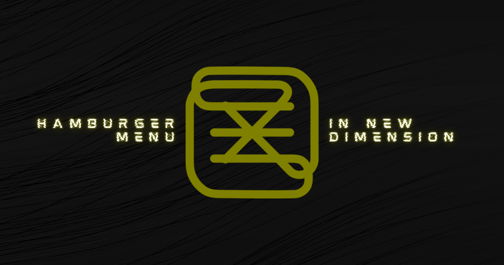

# the-x-animation

## SVG animation study

Inspired by article [The 🍔 menu
](https://uxdesign.cc/the-menu-210bec7ad80c), this website presents several types of svg animation created in CSS. You can check it right now: [dorotapindur.github.io/the-x-animation/](https://dorotapindur.github.io/the-x-animation/).
Click `X` to see it moving; click `/show code/` to see code snippet. Don't hesitate to use the code in your projects!

Have fun! :)